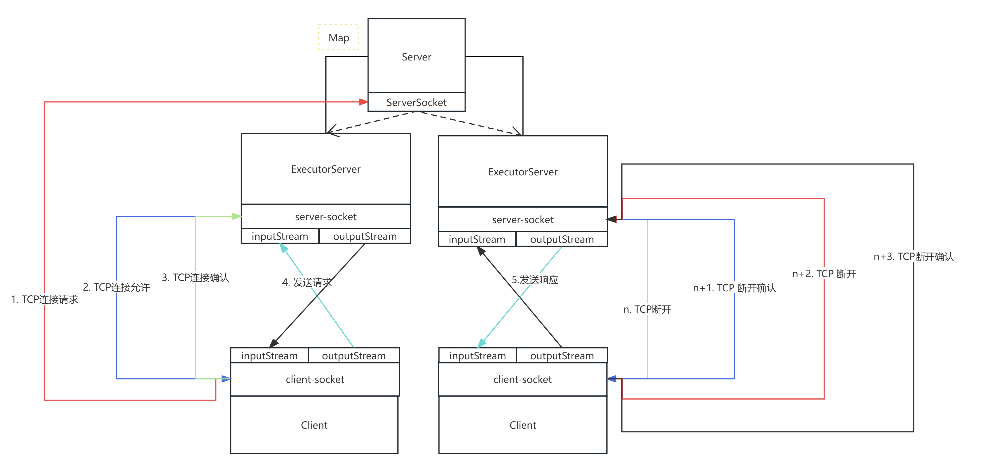
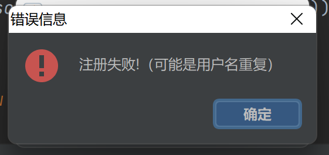
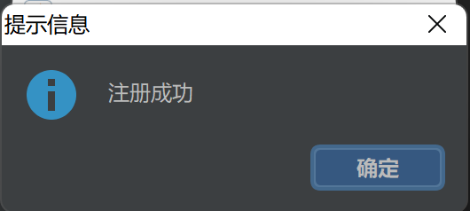
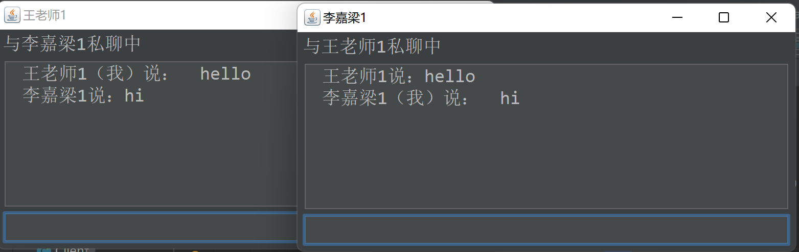
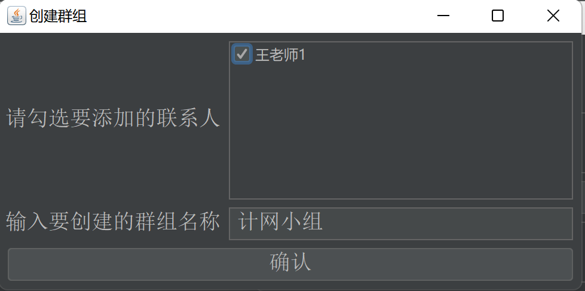
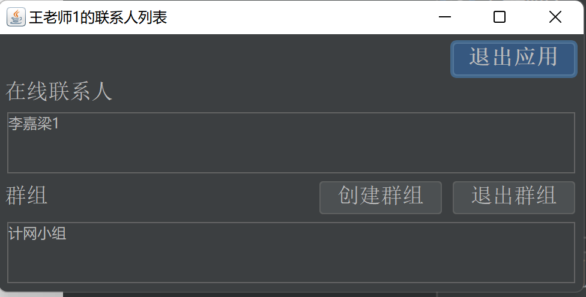
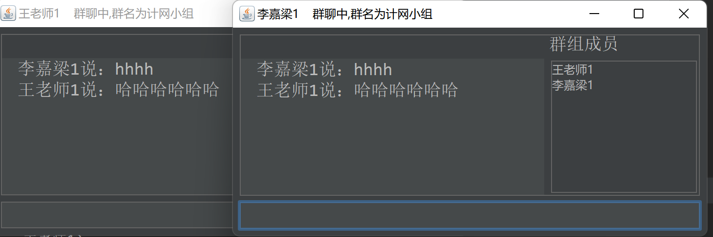
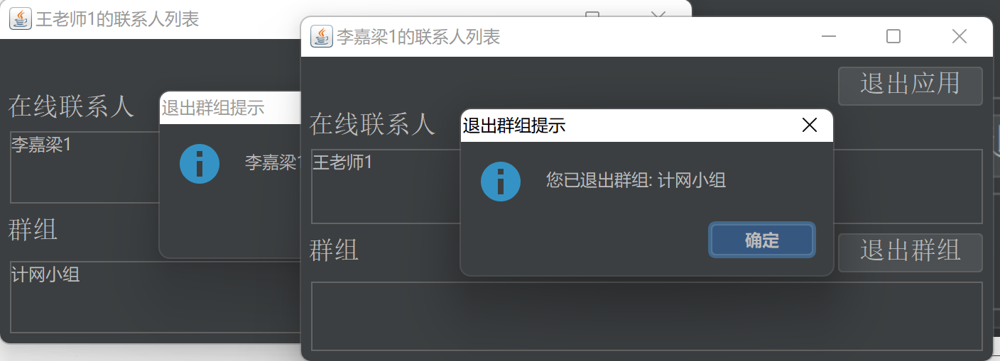

[toc]

# **基于** socket **的聊天室服务器与客户端实现**

**姓    名：** 李嘉梁  
**学    号：** 211302104  
**班    级：** 计算机 211

## 1. 设计要求

分别实现聊天室的一对客户端程序和服务器程序，基于 TCP 协议。具体功能描述如下：

#### 1、 登录功能：

- 用户通过指定昵称进行登录。如果该昵称已被使用，服务器进行相应提示；如果该昵称未被使用，用户则登录成功。

#### 2、私信聊天功能：

- 两个已登录的用户能够私信聊天，聊天信息通过服务器转发。

#### 3、 群组聊天功能：

- 用户能够创建一个或多个聊天群组；用户能够加入已存在的群组、在群组内发送消息、接收群组内任一用户的消息、离开群组。
  报告中需画出客户端与服务器的关键步骤及交互流程图（类似于下图，使用中文）。
  需对关键模块代码进行截图说明，并截图展示运行结果。

## 2. 交互流程图




## 3. 功能实现

#### 1、登陆功能

- 先在数据库中注册，注册成功（说明用户名不重复）则可登录，登录成功进入在线用户列表页面

#### 2、私聊功能

- 点击用户列表中的用户名可进入私聊功能

#### 3、群聊功能

- 点击群组列表中的群名可进入群聊功能

#### 4、建群功能

- 点击用户列表中的创建群组，弹出创建群组页面，勾选群中要邀请的人，起群名后点击确认，将信息提交到服务器
- 客户端收到服务器发过来的建群消息，创建群组，刷新群组列表

#### 5、退群功能

- 点击用户列表中的退出群组，弹出退出群组页面，勾选要退的群，点击确认，将信息提交到服务器
- 客户端收到服务器发过来的退群消息，刷新群组列表

## 4. 应用技术

##### 1、网络编程 

- 在网络中传输客户端与服务器的数据

##### 2、JDBC

- 将用户注册数据传送到数据库，用户登录时在数据库中查找是否存在此用户信息，用户信息存在且正确时用户登陆成功

##### 3、Swing

- 将程序界面化

##### 4、多线程

- 服务器端：实现与多个客户端的数据传输（为每个客户端创建一个线程）
- 客户端 ：主线程实现发送数据给服务器，创建守护线程不断监听并处理服务器发送过来的数据

## 5. 关键模块代码

1. ServerSocket：

   - ServerSocket启动后在端口监听
   - 收到连接请求创建server-socket对client-socket服务

   ```java
   public static void main(String[] args) {
           try {
               //创建一个ServerSocket实例，在指定的端口上等待客户端连接。
               ServerSocket serverSocket = new ServerSocket(PORT);
               System.out.println("服务器启动，等待客户端连接。。。");
               ExecutorService executorService = Executors.newFixedThreadPool(50); // 最大50个线程的线程池
               for(int i = 0; i<50; i++){ // while (true)
                   // accept()会一直阻塞当前线程，直到有客户端发起连接，才返回一个新的与客户端进行通信的Socket对象。
                   Socket socket = serverSocket.accept();
                   System.out.println("有新的连接，端口号为"+socket.getPort());
                   executorService.submit(new Server().new ExecutorServer(socket)); // 将连接的Socket交给线程池的一个线程来处理
               }
           } catch (IOException e) {
               e.printStackTrace();
           }
       }
   ```

2. server-socket：

   - server-socket与client-socket建立连接并提供服务

   ```java
   class ExecutorServer implements Runnable{
           private final Socket client; // 服务每个用户的服务socket
           // 每个与用户交互的Stream
           private Scanner scanner;//输入流，读数据
           private PrintStream printStream; //输出流，写数据
   
           public ExecutorServer(Socket client) {
               this.client = client;
               try {
                   this.scanner = new Scanner(client.getInputStream());
                   this.printStream= new PrintStream(this.client.getOutputStream(),true,"UTF-8");
               } catch (IOException e) {
                   e.printStackTrace();
               }
           }
           @Override
           public void run() {
               while (true){
                   if(scanner.hasNextLine()){
                       //info为json字符串,是客户端发给服务器的消息
                       String info = scanner.nextLine();
                       MessageVO voFromClient = (MessageVO) CommonUtils.Json2Object(info,MessageVO.class);
                       String type = voFromClient.getType();
                       String content = voFromClient.getContent();
                       String to = voFromClient.getTo();
                       String from = voFromClient.getFrom();
                       // ... 业务逻辑
                   }
               }
           }
   
   
           //群聊找到要发的客户端，发送
           private void send(String message,Set<String> userSet){
               for(Map.Entry<String,PrintStream> entry : printStreamMap.entrySet()){
                   if(userSet.contains(entry.getKey())){
                       entry.getValue().println(message);
                   }
               }
           }
   
           //私聊找到要发的客户端，发送
           private void send(String str,String toFriendName){
               printStreamMap.get(toFriendName).println(str);
           }
   
           /**
            * 向所有在线用户发送新用户上线信息或者群聊
            * @param message  要发送的数据
            */
           private void sendAll(String message,String name){
               //Set<Map.Entry<K,V>> entrySet();
               for(Map.Entry<String,PrintStream> entry : printStreamMap.entrySet()){
                   if(!Objects.equals(entry.getKey(), name)){
                       entry.getValue().println(message);
                   }
               }
           }
       }
   ```

3. client-socket：

   - client-socket与server-socket建立连接

   ```java
   public Connect2Server() {
           try {
               this.client = new Socket(IP,PORT); // 客户端Socket
               scanner = new Scanner(client.getInputStream());
               printStream = new PrintStream(client.getOutputStream(),true,"UTF-8");
           } catch (IOException e) {
               System.out.println("与服务器建立连接失败");
               e.printStackTrace();
           }
       }
   ```

   

## 6. 运行结果

(1) 登录功能：用户通过指定昵称进行登录。

如果该昵称已被使用，服务器进行相应提示；



如果该昵称未被使用，用户则登录成功。



(2) 私信聊天功能：两个已登录的用户能够私信聊天，聊天信息通过服务器转发。



(3) 群组聊天功能：用户能够创建一个或多个聊天群组；用户能够加入已存在的群组、

在群组内发送消息、接收群组内任一用户的消息、退开群组。







